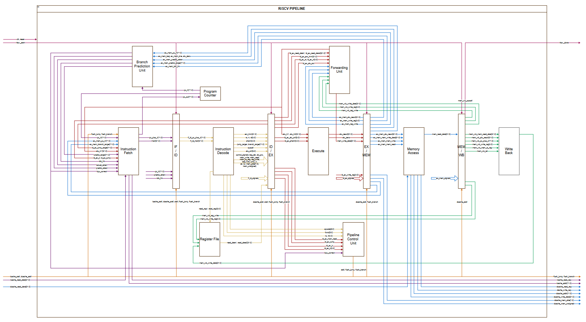
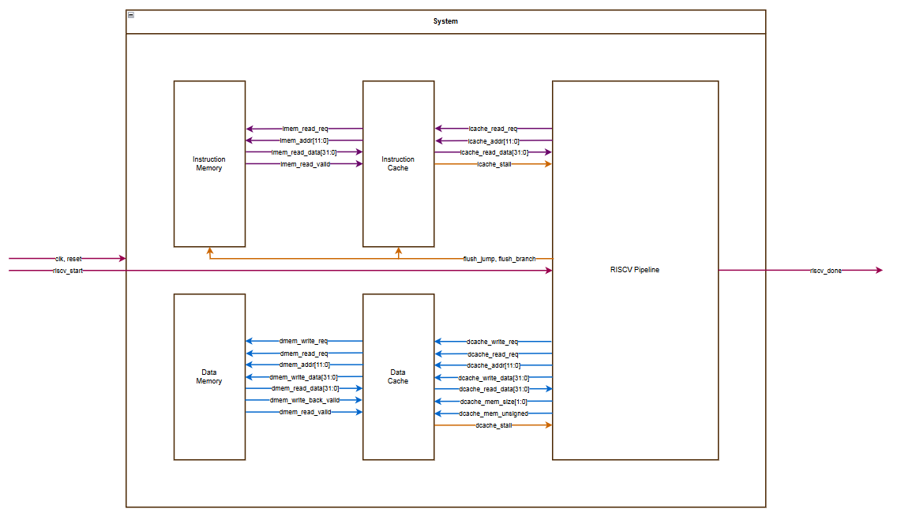
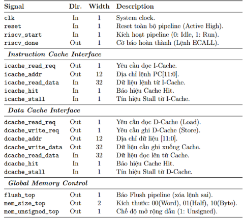

# RISC-V 5-Stage Pipelined Processor with Cache and Branch Prediction

This repository contains a Verilog implementation of a 32-bit RISC-V processor featuring a classic 5-stage pipeline (IF, ID, EX, MEM, WB). The design is enhanced with high-performance features including a set-associative Cache system, Branch Prediction Unit (BPU), and a Multiplier-Divider Unit (MDU).

## 🚀 Key Features

### 1. 5-Stage Pipeline Architecture
- **Instruction Fetch (IF):** Features a Program Counter (PC) with support for stall and flush operations.
- **Instruction Decode (ID):** Includes a Control Unit for RISC-V base instructions and immediate extension logic.
- **Execute (EX):** Contains the ALU, a dedicated Multiplier-Divider Unit (MDU), and branch outcome evaluation.
- **Memory Access (MEM):** Handles data memory operations through a Data Cache interface.
- **Write Back (WB):** Selects between ALU results, memory data, or return addresses to write back to the Register File.

### 2. Advanced Memory System
- **Instruction Memory (IMem):** 4KB, 2 cycles latency.
- **Data Memory (DMem):** 4KB, 2 cycles latency, support access by word, half word and byte, signed and unsigned.
- **Instruction Cache (ICache):** 256B, read-only, 2-way set-associative cache using a Tree-PLRU (Pseudo-Least Recently Used) replacement policy.
- **Data Cache (DCache):** 256B, read-write, 4-way set-associative cache with **Write-Back** policiy to maintain data consistency efficiently.
- **Bus Interface:** Ready to interface with larger system memories via request/valid handshaking.

### 3. Branch Prediction Unit (BPU)
- Uses a **Branch Target Buffer (BTB)** and a **Branch History Table (BHT)** to predict instruction flow and minimize pipeline stalls caused by control hazards.
- Dynamic prediction logic updates based on actual execution outcomes in the Memory stage.

### 4. Hazard Handling
- **Forwarding Unit:** Resolves data hazards (RAW) by forwarding data from EX/MEM and MEM/WB stages back to the ID/EX stage.
- **Pipeline Control Unit:** Manages stalls for Load-Use hazards and flushes for branch/jump instructions.

### 5. Multiplier-Divider Unit (MDU)
- Supports RISC-V "M" extension-like operations with dedicated hardware multiplier and divider that can stall the pipeline until the computation completes.
- The BITS_PER_CYCLE parameter allows a trade-off between system frequency, multiplication throughput, and hardware area.
- Example: For multiplier-intensive applications (e.g., DSP), a higher BITS_PER_CYCLE is required to boost throughput and reduce latency. For general-purpose integer tasks where multiplication is rare, a lower BITS_PER_CYCLE (e.g., 1 bit/cycle) is ideal to minimize area and maintain high clock speeds.

### 6. Block diagram

### 7. Top module I/O table

## 📂 Project Structure

- `riscv_pipeline.v`: The top-level module of the processor core, integrating all stages and control units.
- `top.v`: System-level wrapper connecting the processor to ICache, DCache, and main memory.
- `instruction_fetch.v`, `instruction_decode.v`, `execute.v`, `memory_access.v`, `write_back.v`: Individual pipeline stage implementations.
- `data_cache.v` & `instruction_cache.v`: Cache controllers with Tree-PLRU and FSM logic.
- `branch_prediction_unit.v`: Logic for BTB and BHT management.

## 🛠 Specifications
- **ISA:** RISC-V RV32I (with partial M-extension support).
- **Technology:** Verilog HDL.
- **Target:** FPGA (optimized for Xilinx Vivado flow, includes `.dcp` checkpoints).
- **Board:** Arty Z7-20.

## 📊 Results
1. Verified all core functionalities of the processor like pipeline, read/write cache/memory, dynamic branch prediction, all instructions and handle hazards.
2. Tested with Assembly program like Fibonacci, Factorial, GCD...
3. Implement at 400+ MHz if memories are not BRAM, 300+ MHz if they are configed to use as BRAM with no timming error.
4. Run on Arty Z7-20 with Fibonacci program and check correction with LEDs on board.

